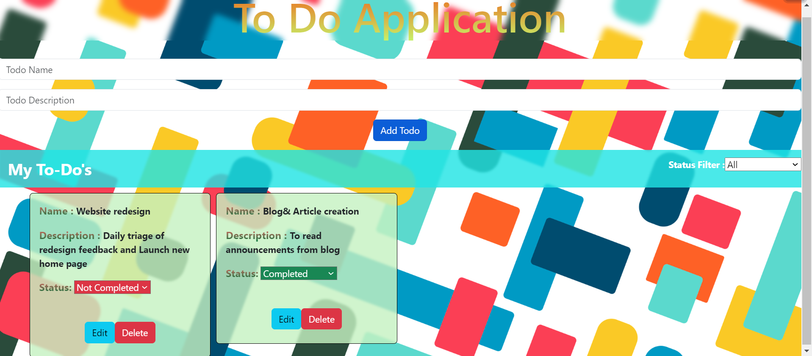

# To-Do Application

A simple To-Do application built using React, where you can manage your tasks and keep track of their completion status.

## Table of Content

- [Features](#features)
- [Getting Started](#getting-started)
- [Install dependencies](#install-dependencies)
- [Run the development server](#run-the-development-server)
- [Live Demo](#live-demo)
- [Technologies Used](#technologies-used)
- [Nelify Deployed Website](#nelify-deployed-website)
- [License](#license)

## Features

- Add new tasks with names and descriptions.
- Mark tasks as "Completed" or "Not Completed".
- Edit existing tasks.
- Delete tasks.
- Filter tasks based on completion status.

## Getting Started

1. Clone the repository:

   git clone https://github.com/Shanmugamrskfamily/To-Do-Task-React.git
   Navigate to the project directory:

   cd todo-application

## Install dependencies:

npm install

## Run the development server:

npm start
The application will be available at http://localhost:3000.

## Live Demo

## Technologies Used

- React
- Bootstrap

## Nelify Deployed Website

Netlify Link- https://to-do-task-manager-react-guvi.netlify.app/ 

## License

This project is licensed under the MIT License.
